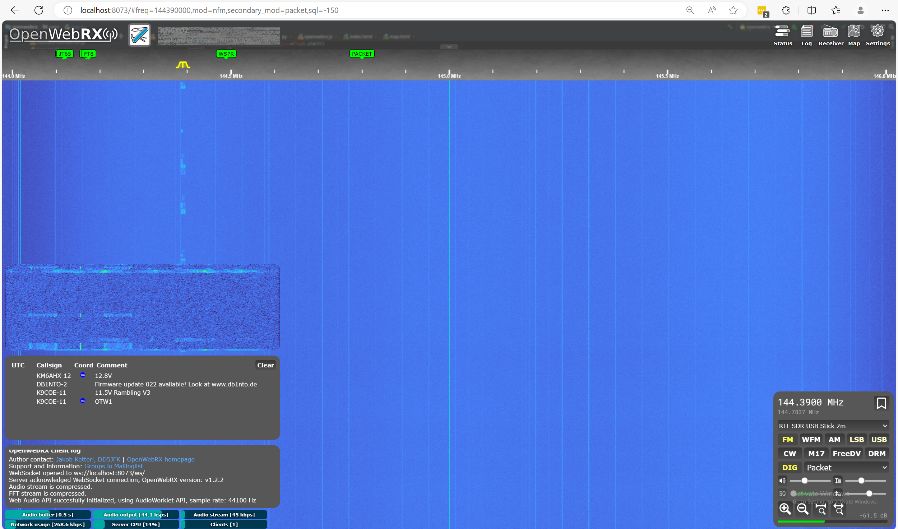

There is a way to connect USB to WSL2.  Here's a loosely noted outline for how I was able to get my RTL-SDR USB device working in a Docker container on WSL2 running on a Windows 11 Host.  The initial guidance docs were actually available from [Microsoft for Connecting USB in WSL](https://learn.microsoft.com/en-us/windows/wsl/connect-usb) but have tried to simplify the steps and provide a format that is easier to follow.

## Install the USBIPD-WIN project

Support for connecting USB devices is not natively available in WSL, so you will need to install the open-source [usbipd-win](https://github.com/dorssel/usbipd-win/releases) project.

1. Go to the [release page for the usbipd-win project on Github.com](https://github.com/dorssel/usbipd-win/releases).
1. Select the `.msi` file, which will download the installer.
   (You may get a warning asking you to confirm that you trust this download).
1. Run the downloaded `usbipd-win_x.msi` installer file.

## List USB Devices

From Terminal / Host machine -- not the wsl environment -- list devices

```powershell
PS C:\Users\bk> usbipd list
Connected:
BUSID  VID:PID    DEVICE                                                        STATE
4-3    0000:0002  Unknown USB Device (Device Descriptor Request Failed)         Not shared
6-1    0bda:2838  RTL2838UHIDIR                                                 Attached
6-2    0a12:0001  Generic Bluetooth Radio                                       Not shared
8-4    046d:c52b  Logitech USB Input Device, USB Input Device                   Not shared

Persisted:
GUID                                  DEVICE

```

## Bind USB Devices

```powershell
PS C:\Users\bk> usbipd bind -b 6-1
```
> This must be run as Administrator

## Attach USB Devices to WSL

```powershell
PS C:\Users\bk> usbipd attach --busid 6-1 --wsl "Debian"
usbipd: info: Selecting a specific distribution is no longer required. Please file an issue if you believe that the default selection mechanism is not working for you.
usbipd: info: Using WSL distribution 'Debian' to attach; the device will be available in all WSL 2 distributions.
usbipd: info: Using IP address 172.31.64.1 to reach the host.
```

## Use RTL-SDR USB like normal within WSL and Docker Containers

```sh
$ sudo rtl_test
[sudo] password for shuttle:
Found 1 device(s):
  0:  Realtek, RTL2838UHIDIR, SN: 00000001

Using device 0: Generic RTL2832U OEM
```

My end goal was to use the RTL-SDR USB device attached to the Windows host in an [OpenWebRX](https://github.com/jketterl/openwebrx) docker container running on the Windows host.  Thankfully WSL2 + USBIPD-WIN result in a seemless experience and this is relatively easy to accomplish.

Example `docker-compose.yml`:

```yaml
version: '3'
services:
  openwebrx:
    image: jketterl/openwebrx:stable
    restart: unless-stopped
    volumes:
      - ./openwebrx/settings:/var/lib/openwebrx
    ports:
      - 8073:8073
    devices:
      - /dev/bus/usb:/dev/bus/usb
    tmpfs:
      - /tmp/openwebrx
```
> The `devices: - /dev/bus/usb:/dev/bus/usb` is what exposes the USB devices available in WSL to the container

Here is a screenshot of OpenWebRX running in a container on a Windows Host using WSL2:
[](openwebrx-container.png)
