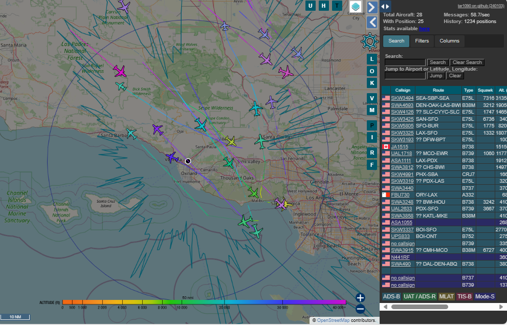
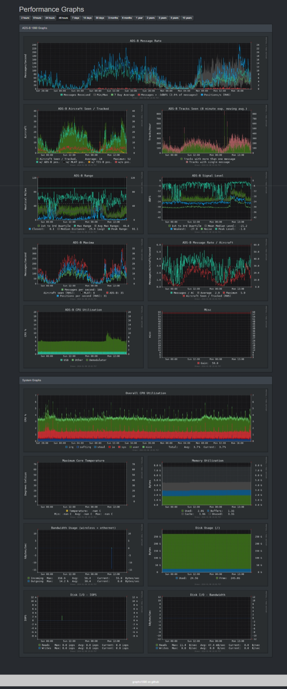

I am using a fairly odd setup, so there's some assumptions that are made when I write this post:

- Application which needs `rtl-sdr` device is running in a container on a host that the device is connected to.  This is normally not an issue on linux systems with the `--device` flag but see next bullet..
- Container host is a windows host [`rtl-sdr` devices are passed through to the container using usbip-win](https://b10a.co/posts/2023/12/rtlsdr-in-wsl/)

So, assuming that you have no issues on your machine communicating with your rtl-sdr device (`rtl_test` works, etc..) and you are using containers or Docker compose.... this may be helpful for you..

## The Motivation

I originally installed OpenWebRX as a proof of concept to see if open source software, which is readily available in a containerized format, could be added easily to my homelab which consisted of containerized applications running on a single windows host.

OpenWebRX is great for receiving many different types of signals and it was great for me to use for the initial validating docker containers on Windows hosts can use an rtl-sdr device -- but it lacks the some of the features other ADS-B solutions provide.  As an enhancement, I was considering [Ionosphere](https://github.com/cceremuga/ionosphere) first as the replacement for OpenWebRX.. But recently I stumbled upon [docker-adsb-ultrafeeder](https://github.com/sdr-enthusiasts/docker-adsb-ultrafeeder) on GitHub.com, which gave me the motivation to give this next phase a try.

## The Implementation

Because I've already figured out how to use `rtl-sdr` devices in containers, I decided to use the same approach with docker-adsb-ultrafeeder.  My new service definition for docker-adsb-ultrafeeder looks like this:

```yaml
  ultrafeeder:
    image: ghcr.io/sdr-enthusiasts/docker-adsb-ultrafeeder
    # Note - if you want to enable telegraf for use with InfluxDB/Prometheus and Grafana,
    # use the following image instead:
    # image: ghcr.io/sdr-enthusiasts/docker-adsb-ultrafeeder:telegraf
    tty: true
    hostname: ultrafeeder
    restart: unless-stopped
    device_cgroup_rules:
      - "c 189:* rwm"
    devices:
      - /dev/bus/usb:/dev/bus/usb
    ports:
      - 8888:80 # to expose the web interface
      - 9273-9274:9273-9274 # to expose the statistics interface to Prometheus
    environment:
      # --------------------------------------------------
      # general parameters:
      - LOGLEVEL=error
      - TZ=US/Pacific
      # --------------------------------------------------
      # SDR related parameters:
      - READSB_DEVICE_TYPE=rtlsdr
      #
      # --------------------------------------------------
      # readsb/decoder parameters:
      - READSB_LAT=34
      - READSB_LON=-119
      - READSB_ALT=100m
      - READSB_RX_LOCATION_ACCURACY=2
      - READSB_STATS_RANGE=true
      #
      # --------------------------------------------------
      # TAR1090 (Map Web Page) parameters:
      - UPDATE_TAR1090=true
      - TAR1090_DEFAULTCENTERLAT=34
      - TAR1090_DEFAULTCENTERLON=-119
      - TAR1090_MESSAGERATEINTITLE=true
      - TAR1090_PLANECOUNTINTITLE=true
      - TAR1090_ENABLE_AC_DB=true
      - TAR1090_FLIGHTAWARELINKS=true
      - HEYWHATSTHAT_ALTS=3000,10000,30000,40000
      - TAR1090_SITESHOW=true
      - TAR1090_RANGE_OUTLINE_COLORED_BY_ALTITUDE=true
      - TAR1090_RANGE_OUTLINE_WIDTH=2.0
      - TAR1090_RANGERINGSDISTANCES=50,100,150,200
      - TAR1090_RANGERINGSCOLORS='#1A237E','#0D47A1','#42A5F5','#64B5F6'
      - TAR1090_USEROUTEAPI=true
      #
      # --------------------------------------------------
      # GRAPHS1090 (Decoder and System Status Web Page) parameters:
      - GRAPHS1090_DARKMODE=true
      #
      # --------------------------------------------------
      # Prometheus and InfluxDB connection parameters:
      - PROMETHEUS_ENABLE=true
    volumes:
      - ./ultrafeeder/globe_history:/var/globe_history
      - ./ultrafeeder/graphs1090:/var/lib/collectd
      - /proc/diskstats:/proc/diskstats:ro
    tmpfs:
      - /run:exec,size=256M
      - /tmp:size=128M
      - /var/log:size=32M
```

> Note: You should replace values for env `TAR1090_DEFAULTCENTERLAT`, `TAR1090_DEFAULTCENTERLON`, `READSB_LAT`, and `READSB_LON` with your own latitude and longitude.  I've provided some defaults that are close to my location, but you should change them to your own location for an improved experience when loading the map.

## The Results

The reason I am actually writing something about this is because the additional capabilities that [docker-adsb-ultrafeeder](https://github.com/sdr-enthusiasts/docker-adsb-ultrafeeder) has provided is useful and interesting.

[docker-adsb-ultrafeeder](https://github.com/sdr-enthusiasts/docker-adsb-ultrafeeder) provides both graphs1090 and tar1090 web interfaces.  The tar1090 interface provides a map with aircraft and other information and is the main interface that is used for seeing what has been decoded recently, and historically.  The graphs1090 interface provides historical statistics as monitoring metrics for various metrics specific to ADS-B (message count, signal, aircraft count, etc..) as well as information about the applications and host system.

I currently am only using this as a decoder, mapping / visualization tool, and statistics logger -- with all forwarding disabled.  I understand a lot of the capabilities this piece of software is designed for is related to forwarding signals, but for my uses it's working great as a headles, local-only solution.

Something else that I may leverage in the future with my homelab is the ability to ingest/persist the monitoring metrics provided by graphs1090 into a time-series database such as InfluxDB or Prometheus.  This would allow me to use Grafana to visualize the metrics in a more flexible way than the graphs1090 interface provides.  I haven't done this yet, but it's a great option to have.

[](tar1090.png)

[](graph1090.png)
