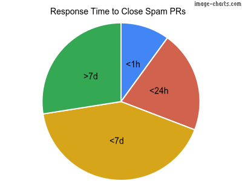

My [Guestbook](/guestbook) page, which contains [a simple form accepting posts without any authentication required](/posts/2023/06/guestbook-for-hugo-using-staticman/), quickly became a battleground between me and relentless spam bots [[1](/posts/2025/03/the-bots-are-winning-but-have-not-won/)][[2](/posts/2025/03/the-bots-are-winning-but-have-not-won/)].  This post is a continuation of my ongoing "fight" to keep the guestbook open, and next steps to hopefully improve the situation.

## Key Statistics on spam post creation

I was able to use creation date from post attempts to produce some insights into the volume and rate of spam posts.  The spam was never published and were rejected in the manual review step.

The majority of days (80 out of 122) had only one spam post.  9 days saw significant bursts of activity with 6-19 spam posts created in a single day.

- **Time range of spam data:** 2023-03-04 to 2025-08-06 (886 days -- 2 years, 5 months)
- **Number of days with at least 1 spam post:** 122 days
- **Total spam posts:** 266
- **Percent of Days with Spam post:** 14% (average 1 every week)
- **Average spam posts created per day:** ~2.18 posts
- **Maximum spam posts created in a day:** 19 (on 2025-08-03)

## Response Time Analysis

Post approval was often reviewed in batches rather than individually upon creation.

- **Average time to close spam posts:** 5.6 days
- **Maximum time to close:** 53 days
- **Closed in <1 hour:** 24 PRs (9%)
- **Closed in <24 hours:** 50 PRs (19%)
- **Closed in <7 days:** 126 PRs (47%)
- **Closed in >7 days:** 66 PRs (25%)

## Next Steps -- a homemade solution

I realized that part of the issue was Staticman was not handling spam as I expected it to, even with the supposed Akismet integration (which I never saw working).  In order to get it working, I also [made changes to the original Staticman code](https://github.com/eduardoboucas/staticman/compare/master...bryankaraffa:staticman:master), which in retrospect added an extra step to the troubleshooting/enhancement process.

This time around, I decided to try and different approach and build a custom solution to handle the requests from scratch.  I am very much a fan of Golang, with the ability to compile to a single binary for any OS/arch and knew I would use it for this project.  I also wanted to continue using Google Cloud Run to keep costs at a minimum for this backend infrastructure.  I landed on using [Gin](https://github.com/gin-gonic/gin) -- marketed as *"a HTTP web framework written in Go (Golang). It features a Martini-like API with much better performance -- up to 40 times faster."*

I used the same design as Staticman as well, where it will handle a POST request, use Akismet and reCAPTCHA to determine if the request is spam, and if valid create the pull request on GitHub.com for review.  The main difference is this so far has been extremely easy to implement/maintain, and I'll be able to add features as needed.

Startups and general response times average around 100ms which is very reasonable for a web form.  Time will tell if the spam mitigation works as it should or if I will need to add additional layers of protection.  The code is available on [GitHub](https://github.com/bryankaraffa/b10a.co/tree/main/guestbook-server).

## Conclusion

As I have mentioned before, this is intended to be an **experiment**, and I am enjoying keeping it going because so far it has been low stakes.  The biggest pain point has been time and frequency needed to moderate the volume of spam.  I look forward to seeing how this new backend performs over time.

If you are a real person and enjoyed this post, please consider signing the [Guestbook](/guestbook) yourself.